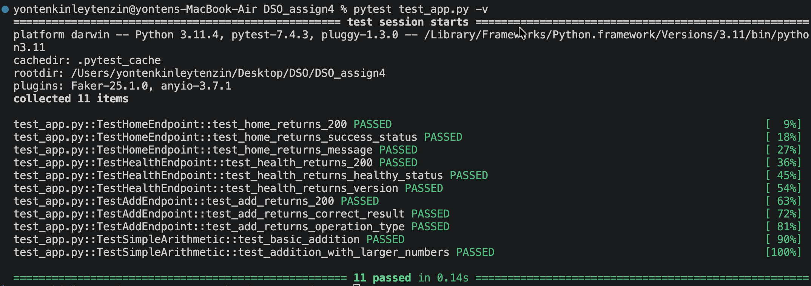
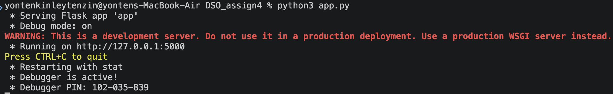
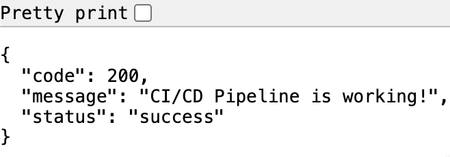
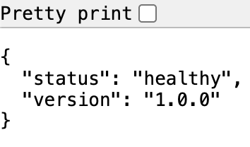
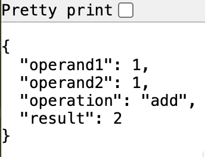
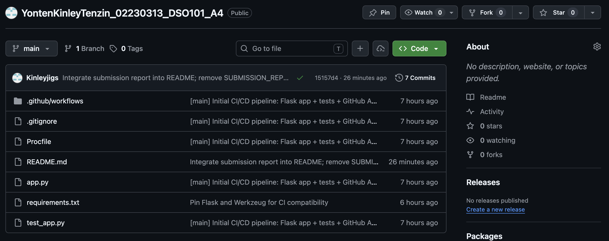
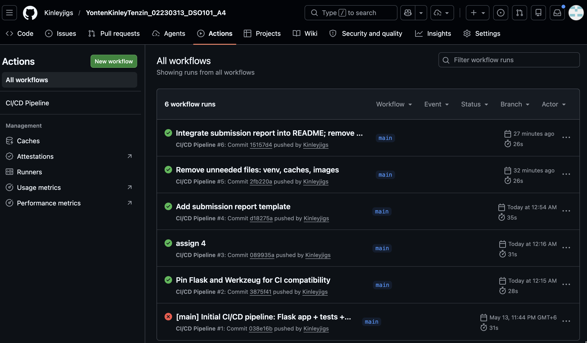
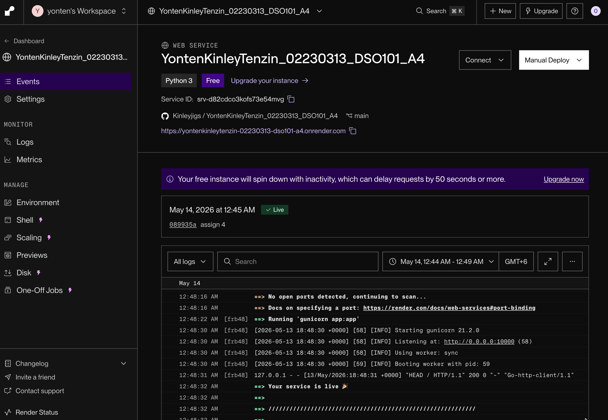

# Assignment 4: CI/CD Pipeline - Flask Backend

**Name:** YontenKinleyTenzin

**Student No:** 02230313

This report matches the actual code in this repository. The Flask app currently exposes 3 endpoints, and the CI/CD pipeline covers testing and deployment for that app.

## Project Overview

This repository contains:

- `app.py` - Flask application
- `test_app.py` - unit tests
- `requirements.txt` - dependencies
- `Procfile` - Render start command
- `.github/workflows/ci.yml` - GitHub Actions workflow

## Application Endpoints

### Home Endpoint

`GET /`

Returns a success message confirming the app is running.

```json
{
	"status": "success",
	"message": "CI/CD Pipeline is working!",
	"code": 200
}
```

### Health Check Endpoint

`GET /health`

Returns the health status of the application.

```json
{
	"status": "healthy",
	"version": "1.0.0"
}
```

### Add Endpoint

`GET /api/add`

Returns a simple arithmetic result used for testing.

```json
{
	"operation": "add",
	"operand1": 1,
	"operand2": 1,
	"result": 2
}
```

## Technology Stack

| Technology | Purpose |
|---|---|
| Python | Backend language |
| Flask | Web framework |
| pytest | Testing framework |
| GitHub Actions | CI automation |
| Render | Deployment platform |
| gunicorn | Production server |

## How It Works

1. Edit the Flask app locally.
2. Run `pytest test_app.py -v`.
3. Push the code to GitHub.
4. GitHub Actions runs automatically.
5. If tests pass, Render deploys the app.
6. The live app becomes available through the Render URL.

## Testing

The tests in `test_app.py` verify the 3 routes:

- Home endpoint returns the expected success JSON.
- Health endpoint returns `healthy` and a version.
- Add endpoint returns `result: 2`.

## Deployment

Render uses the `Procfile` below to start the app:

```bash
web: gunicorn app:app
```

## How to Run Locally

1. Create and activate a virtual environment.
2. Install dependencies with `pip install -r requirements.txt`.
3. Run the tests with `pytest test_app.py -v`.
4. Start the Flask app with `python app.py`.
5. Open `http://127.0.0.1:5000/` in your browser.

## Evidence and Screenshots

### Screenshot 1 - Local pytest results



### Screenshot 2 - Flask app running locally



### Screenshot 3 - Home endpoint



### Screenshot 4 - Health endpoint



### Screenshot 5 - Add endpoint



### Screenshot 6 - GitHub repository



### Screenshot 7 - GitHub Actions passed

**Capture:** Show the successful workflow result.



### Screenshot 8 - Live Render app




## Step-by-Step Screenshot Guide

1. Run `pytest test_app.py -v` and capture the passing output.
2. Run `python app.py` and capture the running server terminal.
3. Open `http://127.0.0.1:5000/` and capture the home endpoint.
4. Open `http://127.0.0.1:5000/health` and capture the health endpoint.
5. Open `http://127.0.0.1:5000/api/add` and capture the add endpoint.
6. Open the GitHub repository page and capture the file list.
7. Open the Actions tab and capture a running workflow.
8. Open the completed workflow and capture the passed status.
9. Open the Render dashboard and capture the deployment status.
10. Open the live Render URL and capture the JSON response.

## Submission Checklist

- The Flask app runs locally without errors.
- All tests pass with `pytest test_app.py -v`.
- The GitHub Actions workflow runs successfully.
- The Render deployment is live and accessible.
- All screenshot placeholders are replaced with real images.
- The final report matches the actual code in the repository.

## Key Learnings

This assignment helped me understand the basic CI/CD flow from local development to automated testing and cloud deployment. I learned how unit tests support code quality, how GitHub Actions automates repeated tasks, and how Render can publish a Flask app as a live web service.

## Conclusion

This is a small but complete CI/CD demo for a Flask application. The code is tested automatically, the workflow is defined in GitHub Actions, and the app can be deployed to Render.

## Live Application

Render URL: https://yontenkinleytenzin-02230313-dso101-a4.onrender.com 
